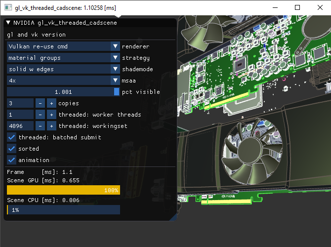
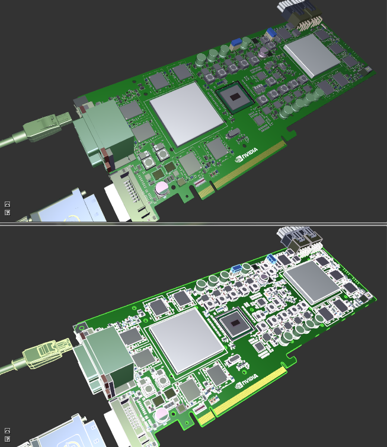

# Vulkan & OpenGL Threaded CAD Scene Sample

The "threaded cadscene" sample allows comparing various rendering approaches using core OpenGL, extended OpenGL via bindless graphics and NV_command_list as well as Vulkan. It does make use of NVIDIA specific extensions to use Vulkan within an OpenGL context and display a Vulkan image.

> **Note** This sample currently builds two executables: gl_vk_... has both GL and Vulkan within the same GL window using a NVIDIA extension, the vk_... one uses WSI and pure Vulkan. There is also a cmake build option to remove the gl_vk_ exe and build the only the vk_ exe. For Vulkan it is recommended to use the Vulkan stand-alone exe for Vulkan performance investigation and debugging.

The content being rendered in the sample is a CAD model which is made of many parts that have few triangles. Having such low complexity per draw-call can very often result into being CPU bound. 

The sample is a fork of the public [cadscene OpenGL sample](https://github.com/nvpro-samples/gl_cadscene_rendertechniques) and introduces the usage of multiple CPU threads.  




By default a performance graph is drawn that illustrates the relative costs of rendering. The top green bar represents GPU time, and the lower blue bar CPU time. The bar that extends the furthest is the primary bottle-neck. Be aware that the GPU costs may appear higher than actual, when very CPU bound as discussed below in the performance section. When cloning the model multiple times the scene complexity is increased, however the sample does **not use instancing** for this, but generates actual bindings/drawcalls for the new objects. An animation effect can also be activated to "explode" the model by modifying the matrices on the GPU.


### Scene Setup

The sample loads a cadscene file (csf), which is a inspired by CAD applications' data organization, just that for simplicity everything is stored in a single RAW file.

The Scene is organized in:

 * Matrices: object transforms as well as concatenated world matrices 
 * TreeNodes: a tree consisting hierarchical information, mapping to Matrix indices

 * Materials: just classic two-sided OpenGL phong material parameters
 * Geometries: storing vertex and index information, and organized in
  * GeometryParts, which reference a sub-range within index buffer, for either "edge" or "solid" surfaces

 * Objects, that reference Geometry and have corresponding
  * ObjectParts, that encode Material and Matrix assignment on a part-level. Typically an object uses just one Matrix for all parts.

When animation is activated, the matrices will be animated through a compute shader, resulting in a "explosion view" of the model. One buffer stores all matrices, another all materials. Geometry is stored in multiple buffers for OpenGL, and only one in the Vulkan case (can be changed via ```USE_SINGLE_GEOMETRY_BUFFERS```).


### Shademodes



- **solid**: just triangles are drawn (upper image)
- **solid with edges**: triangles and edge outlines on top, using polygonoffset to push triangles back (lower image). When no global sorting (see later) is performed, it means we toggle between the two modes for every object. Alongside the mode changes is a shader change, so that wireframe is unlit. The shader change for that effect is not really necessary, and toggling so often is not optimal, but it creates some artificial load for the graphics api.

When the "min statechanges" option is enabled, we will draw first solid then edges, effectively reducing the number of shader changes dramatically.

### Strategies

These influence the number of drawcalls we generate for the hardware and software. The strategy is applied on a per-object level. 
Imagine an object whose parts use two materials, red and blue:
```
material: r b b r
parts:    A B C D
```
- **materialgroups**
Here we create a per-object cache of drawcall ranges based on the object's material and matrix assignments. We also "grow" drawcalls if subsequent ranges in the index buffer have the same assignments. Our sample object would be drawn using 2 states, which are creating 3 hardware drawcalls: red are ranges A, D and blue is B+C joined together as they are next to each other in the indexbuffer.
- **drawcall individual**
We render each piece individually:
red A, blue B, C, red D.

Typically we do all rendering with basic state redundancy filtering so we don't setup a matrix/material change if the same is still active. To keep things simple for state redundancy filtering, you should not go too fine-grained, otherwise all the tracking causes too much memory hopping. In our case we have 3 indices we track: geometry (handles vertex / index buffer setup), material and matrix.

Global sorting of all items can be enabled with the "min statechanges" option. This will sort all items to reduce the amount of state changes.

## Renderers

Upon renderer activation the scene is traversed and encoded into a list of "drawitems". Optionally this list can be globally sorted once with the "min statechanges" option. All renderers operate from the same "drawitems" list.

By default all renderers also use the same principle state and binding sequences. VBO/IBO bind per geometry change, a uniform buffer range bind per material and a matrix change. Vulkan does allow alternative ways to pass the uniform data, which is discussed in a separate file.

#### Variants:

 - **default**: we traverse the list and either directly render from it, or build temporary command-buffers every frame.

 - **re-use**: command-buffers are built only once and then re-used when rendering. This typically yields lowest CPU costs.

 - **MT**: multi-threaded, makes use of N worker-threads to build the command-buffers. The list is processed in chunks of *workingset* many items. Each thread grabs an available chunk. The global drawing order may be different every frame. When *batched submission* is active, the Vulkan renderers trigger their submission method at the end of their processing, i.e. once per frame.
    - **main submit**: command-buffers are passed to the main thread for processing (no mutex for processing step).

    - **worker submit**: the generated command-buffers are processed by the worker-threads directly (but protected by mutex).

### OpenGL Renderers

- **gl core**
All matrices and materials are stored in big buffer objects, which allows us to efficiently bind the required sub-range for a drawcall via `glBindBufferRange(GL_UNIFORM_BUFFER, usageSlot, buffer, index * itemSize, itemSize)`. (Using only OpenGL 4.3 core features)
- **gl nvbindless**
Similar as above but using glBufferAddressRange calls passing 64-bit GPU addresses instead of GL object handles. (NV_vertex_buffer_unified_memory, NV_uniform_buffer_unified_memory).
- **gl re-use nvcmd buffer**
Uses NV_command_list to encode sequence of drawing and binding commands. They are stored in a GL buffer object and rendered from that.
- **gl re-use nvcmd compiled**
The commands are not stored in a buffer but in the compiled commandlist object, allowing further optimizations especially for state changes like shaders (NV_command_list)
- **gl MT nvcmd main submit**
Persistent mapped buffers are used for storing the commands. The pointers are passed to the worker-threads where the command-buffers are filled. Those threads do not have a GL context. Rendering is done from the main thread. Different buffers are used every other frame to avoid fences (NV_command_list)

### Vulkan Renderers

- **vk re-use cmd**
The entire scene is encoded in a single big command-buffer, and re-used every frame.
- **vk re-use obj-level cmd**
Every object in the scene has its own small secondary command-buffer. This means less optimal state transitions, as each command-buffer must be self contained, there is no state inheritance (other than the rendertarget being used). At render time all the secondaries are referenced by a primary command-buffer that is built per-frame. Given the very few per-object commands, this serves rather as experiment and is not a recommended rendering method.
- **vk MT cmd main submit**
Each thread has FRAMES many CommandBufferPools, which are cycled through. At the beginning the pool is reset and command-buffers are generated from it in chunks. Using another pool every frame avoids the use of additional fences.
Secondary commandbuffers are generated on the worker threads and passed for enqueing into a primary commandbuffer that is later submitted on the main thread.
- **vk MT cmd worker submit**
This time we use primary commandbuffers and directly submit them to the queue from the worker threads. This means we use less optimal renderpasses (need to load/store, instead of clear/store) and we increased the amount of queue submissions, making this slower than the above.

To reduce complexity, the renderers for `VK_NVX_device_generated_commands` were removed, they will get their own sample.

#### Uniform Handling in Vulkan

The sample allows to feed the material and matrix data in various ways to Vulkan by changing the ```UNIFORMS_TECHNIQUE``` define. Please find much more detailed information [here](doc/vulkan_uniforms.md).

## Performance

**Preliminary Results**: The Vulkan driver is still very new and the performance numbers are therefore not final. The benchmark was run on a Quadro M6000, with a first generation i7-860 CPU.

> **Important Note on GPU timings** The GPU time is measured via timestamps. If the "begin" timestamp is in a different driver submission to the GPU (aka pushbuffer) than the "end" timestamp, then CPU bottlenecks will skew the GPU timings. The CPU time between submissions will impact the reported GPU time. This may be the case when very many GPU commands are created per-frame, although it typically affects OpenGL more than Vulkan. 

To get more exact timings about the relative cost of each section, the application does measure the CPU time for the "flush" (Vulkan vkQueueSubmit, OpenGL glFlush) as well. The application does three flushes when animation is active, and two otherwise.

#### Solid, Material-Grouped, 4 model copies
In this scenario we generate around 44k drawcalls all using the same shader. The cost of uniform and geometry buffer binds as well as drawcalls (average ~50 triangles) dominates.

renderer                    | GPU time | CPU time [ms]| 
--------------------------- | -------- | -------- |
gl core                     |      4.1 |     7.8  |
gl nvbindless               |      2.7 |     4.7  |
vk cmd 1 thread             |      1.0 |     1.8  |
vk cmd 2 threads            |      1.0 |     1.0  |
gl nvcmd 1 thread           |      1.2 |     0.9  |
gl nvcmd 2 threads          |      1.2 |     0.6  |
vk re-use cmd               |      1.0 |     0.03 |
vk re-use obj-level cmd     |      3.6 |     1.6  |
gl re-use nvcmd buffer      |      1.0 |     0.05 |
gl re-use nvcmd compiled    |      1.0 |     0.05 |


Our CPU costs are nicely reduced with Vulkan and scale with more threads. By re-using command buffers we can remove the CPU costs almost entirely. We can also see that the re-use of many tiny command buffers is not recommended (in this scenario around 10k secondary buffers per-frame).

The NV_command_list can be a tad faster than Vulkan on the CPU-side, as it benefits of having the API designed directly for the hardware in mind. There are no function calls and the data is formatted in a hardware friendly way. It is expected that Vulkan's performance will improve or that similar mechanisms will be exposed.

#### Solid with Edges, Material-Grouped, 2 model copies
Now we render edges on top of the surfaces. We still generate around 44k drawcalls but half are for triangles, the other for lines. Within every object we toggle between the two and change the shader (not optimal but serves as stress test). The cost of those shader changes now dominates.

renderer                    | GPU time | CPU time  [ms]| 
--------------------------- | -------- | -------- |
gl core                     |  skewed! |    45.0  |
gl nvbindless               |  skewed! |    41.0  |
vk cmd 1 thread             |      3.5 |     1.8  |
vk cmd 2 threads            |      3.5 |     1.0  |
gl nvcmd 1 thread           |      3.5 |     1.5  |
gl nvcmd 2 threads          |      3.5 |     1.5  |
vk re-use cmd               |      3.4 |     0.6  |
vk re-use obj-level cmd     |      3.6 |     1.0  |
gl re-use nvcmd buffer      |      3.0 |     1.1  |
gl re-use nvcmd compiled    |      2.8 |     0.05 |


In this scenario we can see that the modern principles of Vulkan (and NV_command_list) are on a whole new level when it comes to CPU efficiency (and NVIDIA's Quadro OpenGL driver is well-optimized). The shader toggles are just way too costly for a classic graphics API approach.

The NV_command_list doesn't scale with CPU threads as the shader state switching is handled on the main submission thread in a serial fashion. Vulkan, however, still can scale by using more threads.

### Performance Conclusion

Overall Vulkan is a big improvement over unextended OpenGL, especially re-using CommandBuffers can result in greatly reduced CPU cost. In this particular sample NV_command_list is often similar to Vulkan, which does show that OpenGL with proprietary extensions can be very fast. In pure draw-call limited scenarios core OpenGL's MultiDrawIndirect can also be very efficient as seen [in another sample](https://github.com/nvpro-samples/gl_cadscene_rendertechniques).

As this sample only uses two pipeline objects (or state-objects in OpenGL) and the rest of the scene's resources are static as well, Vulkan cannot make use of its greatest strength: generating and validating resources in parallel. Therefore, benchmarks in samples like this are very directed at a certain problem and only demonstrate a snapshot of an APIs capability.

### Building
Make sure to have installed the [Vulkan-SDK](http://lunarg.com/vulkan-sdk/). Always use 64-bit build configurations.

For best Vulkan performance use the vk exe (starting with vk_ ). If you are not interested in building the OpenGL & Vulkan combined exe then use the `BUILD_<projectname>_VULKAN_ONLY` cmake option.

Ideally, clone this and other interesting [nvpro-samples](https://github.com/nvpro-samples) repositories into a common subdirectory. You will always need [nvpro_core](https://github.com/nvpro-samples/nvpro_core). The nvpro_core is searched either as a subdirectory of the sample, or one directory up.

If you are interested in multiple samples, you can use [build_all](https://github.com/nvpro-samples/build_all) CMAKE as entry point, it will also give you options to enable/disable individual samples when creating the solutions.

### Related Samples
[gl cadscene render techniques](https://github.com/nvpro-samples/gl_cadscene_rendertechniques) is most similar to this sample and covers various OpenGL approaches.
[gl commandlist basic](https://github.com/nvpro-samples/gl_commandlist_basic) illustrates the core principle of the NV_command_list extension.
[gl occlusion cullling](https://github.com/nvpro-samples/gl_occlusion_cullling) also uses the occlusion system of this sample, but in a simpler usage scenario.

When using classic scenegraphs, there is typically a lot of overhead in traversing the scene, it is highly recommended to use simpler representations for actual rendering. Flattened hierarchy, arrays... memory friendly data structures, data-oriented design.
If you are still working with a classic scenegraph then [nvpro-pipeline](https://github.com/nvpro-pipeline/pipeline) may provide some acceleration strategies to avoid full scenegraph traversal, of which some are also described in this [GTC 2013 presentation](http://on-demand.gputechconf.com/gtc/2013/presentations/S3032-Advanced-Scenegraph-Rendering-Pipeline.pdf).
